# Class Diagram - Restaurant Reservation System

## Overview
This class diagram represents the domain model and key architectural components of the Restaurant Reservation System built with Next.js, Prisma, and NextAuth.

---

## PlantUML Class Diagram

```plantuml
@startuml
skinparam classAttributeIconSize 0

' Domain Models (Prisma Schema)
class User {
  - id: String {PK}
  - name: String
  - email: String {unique}
  - telephone: String
  - password: String
  - role: Role
  - createdAt: DateTime
  - updatedAt: DateTime
  --
  + getReservations(): Reservation[]
  + canMakeReservation(): boolean
}

class Restaurant {
  - id: String {PK}
  - name: String
  - address: String
  - telephone: String
  - openTime: String
  - closeTime: String
  - createdAt: DateTime
  - updatedAt: DateTime
  --
  + getReservations(): Reservation[]
  + isWithinOperatingHours(time: DateTime): boolean
}

class Reservation {
  - id: String {PK}
  - date: DateTime
  - userId: String {FK}
  - restaurantId: String {FK}
  - createdAt: DateTime
  - updatedAt: DateTime
  --
  + getUser(): User
  + getRestaurant(): Restaurant
}

enum Role {
  USER
  ADMIN
}

' API Route Handlers
class AuthHandler {
  + GET(request: NextRequest): Promise<NextResponse>
  + POST(request: NextRequest): Promise<NextResponse>
}

class RegisterHandler {
  + POST(request: NextRequest): Promise<NextResponse>
  - validateRegistrationData(data: any): boolean
  - hashPassword(password: string): string
}

class RestaurantHandler {
  + GET(request: NextRequest): Promise<NextResponse>
  + POST(request: NextRequest): Promise<NextResponse>
}

class RestaurantByIdHandler {
  + GET(request: NextRequest, params: any): Promise<NextResponse>
  + PUT(request: NextRequest, params: any): Promise<NextResponse>
  + DELETE(request: NextRequest, params: any): Promise<NextResponse>
}

class ReservationHandler {
  + GET(request: NextRequest): Promise<NextResponse>
  + POST(request: NextRequest): Promise<NextResponse>
  - validateReservationLimit(userId: string): Promise<boolean>
  - validateOperatingHours(restaurantId: string, date: DateTime): Promise<boolean>
}

class ReservationByIdHandler {
  + GET(request: NextRequest, params: any): Promise<NextResponse>
  + PUT(request: NextRequest, params: any): Promise<NextResponse>
  + DELETE(request: NextRequest, params: any): Promise<NextResponse>
  - checkOwnership(reservationId: string, userId: string): Promise<boolean>
}

' Authentication & Authorization
class AuthOptions {
  - adapter: PrismaAdapter
  - session: SessionStrategy
  - providers: Provider[]
  - callbacks: Callbacks
  --
  + authorize(credentials: Credentials): Promise<User>
  + jwt(token: JWT, user: User): Promise<JWT>
  + session(session: Session, token: JWT): Promise<Session>
}

class Middleware {
  + middleware(request: NextRequest): NextResponse
  - checkAuth(token: JWT): boolean
  - checkAdminRole(token: JWT): boolean
}

' Database Layer
class PrismaClient {
  + user: UserDelegate
  + restaurant: RestaurantDelegate
  + reservation: ReservationDelegate
  --
  + connect(): Promise<void>
  + disconnect(): Promise<void>
}

' React Components
class Navbar {
  - session: Session
  --
  + render(): JSX.Element
}

class RestaurantCard {
  - restaurant: Restaurant
  --
  + render(): JSX.Element
}

class ReservationForm {
  - restaurantId: string
  - onSubmit: Function
  --
  + handleSubmit(data: FormData): void
  + validateForm(data: FormData): boolean
  + render(): JSX.Element
}

class Providers {
  - children: ReactNode
  --
  + render(): JSX.Element
}

' Page Components
class DashboardPage {
  - session: Session
  - reservations: Reservation[]
  --
  + fetchReservations(): Promise<void>
  + render(): JSX.Element
}

class RestaurantsPage {
  - restaurants: Restaurant[]
  --
  + fetchRestaurants(): Promise<void>
  + render(): JSX.Element
}

class AdminPage {
  - session: Session
  - restaurants: Restaurant[]
  - reservations: Reservation[]
  --
  + fetchData(): Promise<void>
  + render(): JSX.Element
}

class LoginPage {
  + handleLogin(credentials: Credentials): Promise<void>
  + render(): JSX.Element
}

class RegisterPage {
  + handleRegister(userData: UserData): Promise<void>
  + render(): JSX.Element
}

' Relationships

' Domain Model Relationships
User "1" -- "0..*" Reservation : creates >
Restaurant "1" -- "0..*" Reservation : has >
User -- Role : has >

' API Handlers use Domain Models
AuthHandler ..> User : uses
RegisterHandler ..> User : creates
RestaurantHandler ..> Restaurant : manages
RestaurantByIdHandler ..> Restaurant : manages
ReservationHandler ..> Reservation : manages
ReservationHandler ..> Restaurant : validates
ReservationHandler ..> User : validates
ReservationByIdHandler ..> Reservation : manages

' Authentication
AuthOptions ..> User : authenticates
AuthOptions ..> PrismaClient : uses
Middleware ..> AuthOptions : uses

' Database Layer
PrismaClient ..> User : CRUD
PrismaClient ..> Restaurant : CRUD
PrismaClient ..> Reservation : CRUD

' API Handlers use Database
RestaurantHandler ..> PrismaClient : uses
RestaurantByIdHandler ..> PrismaClient : uses
ReservationHandler ..> PrismaClient : uses
ReservationByIdHandler ..> PrismaClient : uses
RegisterHandler ..> PrismaClient : uses

' Components use Domain Models
RestaurantCard ..> Restaurant : displays
ReservationForm ..> Reservation : creates
Navbar ..> User : displays

' Pages use Components
DashboardPage ..> ReservationForm : contains
DashboardPage ..> Navbar : contains
RestaurantsPage ..> RestaurantCard : contains
RestaurantsPage ..> Navbar : contains
AdminPage ..> Navbar : contains
LoginPage ..> AuthHandler : calls
RegisterPage ..> RegisterHandler : calls

' Pages use Domain Models
DashboardPage ..> Reservation : displays
RestaurantsPage ..> Restaurant : displays
AdminPage ..> Restaurant : manages
AdminPage ..> Reservation : manages

@enduml
```

---

## Detailed Class Descriptions

### Domain Models

#### User
**Responsibilities:**
- Represents a system user (regular user or admin)
- Manages user authentication credentials
- Tracks user reservations
- Enforces business rules (e.g., maximum 3 reservations)

**Key Attributes:**
- `id`: Unique identifier (CUID)
- `email`: Unique email address for authentication
- `role`: USER or ADMIN role
- `password`: Hashed password using bcrypt

**Key Relationships:**
- Has many Reservations (1-to-many)

---

#### Restaurant
**Responsibilities:**
- Represents a restaurant in the system
- Stores restaurant contact and location information
- Defines operating hours for validation
- Manages associated reservations

**Key Attributes:**
- `id`: Unique identifier (CUID)
- `openTime`, `closeTime`: Operating hours in HH:MM format

**Key Relationships:**
- Has many Reservations (1-to-many)

---

#### Reservation
**Responsibilities:**
- Represents a booking made by a user for a restaurant
- Links users to restaurants with a specific date/time
- Enforces booking constraints

**Key Attributes:**
- `id`: Unique identifier (CUID)
- `date`: DateTime of the reservation
- Foreign keys to User and Restaurant

**Key Relationships:**
- Belongs to one User (many-to-1)
- Belongs to one Restaurant (many-to-1)

---

### API Route Handlers

#### AuthHandler
**Responsibilities:**
- Handles NextAuth.js authentication requests
- Delegates to AuthOptions configuration

**HTTP Methods:**
- `GET`: Session management
- `POST`: Sign in/sign out

---

#### RegisterHandler
**Responsibilities:**
- Handles user registration
- Validates input data
- Hashes passwords securely
- Creates new user accounts

**Business Rules:**
- Email must be unique
- All required fields must be provided
- Password is hashed with bcrypt (10 rounds)

---

#### RestaurantHandler
**Responsibilities:**
- Handles restaurant listing and creation
- Public GET access for listing
- Admin-only POST access for creation

**Authorization:**
- GET: Public access
- POST: Admin role required

---

#### RestaurantByIdHandler
**Responsibilities:**
- Handles individual restaurant operations
- CRUD operations for specific restaurant
- Includes reservation data in GET response

**Authorization:**
- GET: Public access
- PUT/DELETE: Admin role required

---

#### ReservationHandler
**Responsibilities:**
- Handles reservation listing and creation
- Enforces business rules (3-reservation limit, operating hours)
- Filters reservations based on user role

**Business Rules:**
- Maximum 3 reservations per user
- Reservation time must be within restaurant operating hours
- Users see only their reservations
- Admins see all reservations

---

#### ReservationByIdHandler
**Responsibilities:**
- Handles individual reservation operations
- Enforces ownership (users can only modify their own)
- Admins can modify any reservation

**Authorization:**
- GET/PUT/DELETE: Owner or Admin only

---

### Authentication & Authorization

#### AuthOptions
**Responsibilities:**
- Configures NextAuth.js
- Implements credentials provider
- Manages JWT tokens
- Handles session callbacks

**Key Methods:**
- `authorize`: Validates credentials and returns user
- `jwt`: Adds role and id to JWT token
- `session`: Adds role and id to session object

---

#### Middleware
**Responsibilities:**
- Protects routes requiring authentication
- Enforces admin-only routes
- Redirects unauthorized access

**Protected Routes:**
- `/dashboard/*`: Authenticated users only
- `/admin/*`: Admin role required

---

### Database Layer

#### PrismaClient
**Responsibilities:**
- ORM for database operations
- Type-safe database queries
- Connection management
- Transaction support

**Delegates:**
- `user`: User table operations
- `restaurant`: Restaurant table operations
- `reservation`: Reservation table operations

---

### React Components

#### Navbar
**Purpose:** Navigation bar with authentication status and role-based links

**Features:**
- Displays user name and role
- Shows different links for Users vs Admins
- Logout functionality

---

#### RestaurantCard
**Purpose:** Displays restaurant information in card format

**Features:**
- Shows restaurant name, address, phone, hours
- Link to restaurant details page
- Responsive design

---

#### ReservationForm
**Purpose:** Form for creating new reservations

**Features:**
- Date/time picker
- Restaurant selection
- Form validation
- Submit handler

---

#### Providers
**Purpose:** Wraps app with SessionProvider for NextAuth

**Features:**
- Provides authentication context
- Enables session access in all components

---

### Page Components

#### DashboardPage
**Purpose:** User dashboard showing their reservations

**Features:**
- Lists user's reservations
- Edit/cancel reservation functionality
- Link to make new reservations

---

#### RestaurantsPage
**Purpose:** Public page listing all restaurants

**Features:**
- Grid/list view of restaurants
- Search/filter functionality
- Links to individual restaurant pages

---

#### AdminPage
**Purpose:** Admin control panel

**Features:**
- Manage restaurants (CRUD)
- View all reservations
- User management capabilities

---

#### LoginPage
**Purpose:** User authentication page

**Features:**
- Email/password form
- NextAuth sign-in integration
- Link to registration

---

#### RegisterPage
**Purpose:** New user registration page

**Features:**
- Registration form
- Input validation
- Password hashing
- Redirect to login after success

---

## Design Patterns Used

1. **Repository Pattern**: PrismaClient acts as a repository for data access
2. **MVC Pattern**: Separation of models (Prisma), views (React components), controllers (API handlers)
3. **Middleware Pattern**: Authentication and authorization middleware
4. **Provider Pattern**: SessionProvider for authentication context
5. **Adapter Pattern**: PrismaAdapter adapts Prisma to NextAuth
6. **Strategy Pattern**: Different authentication strategies (Credentials)

---

## Technology Stack

- **Frontend**: Next.js 16, React 19, TypeScript, Tailwind CSS
- **Backend**: Next.js API Routes, NextAuth.js
- **Database**: PostgreSQL with Prisma ORM
- **Authentication**: NextAuth.js with JWT strategy
- **Password Hashing**: bcryptjs