# Sequence Diagrams - Restaurant Reservation System

## Overview
This document contains sequence diagrams for the main workflows in the Restaurant Reservation System.

---

## 1. User Registration Flow

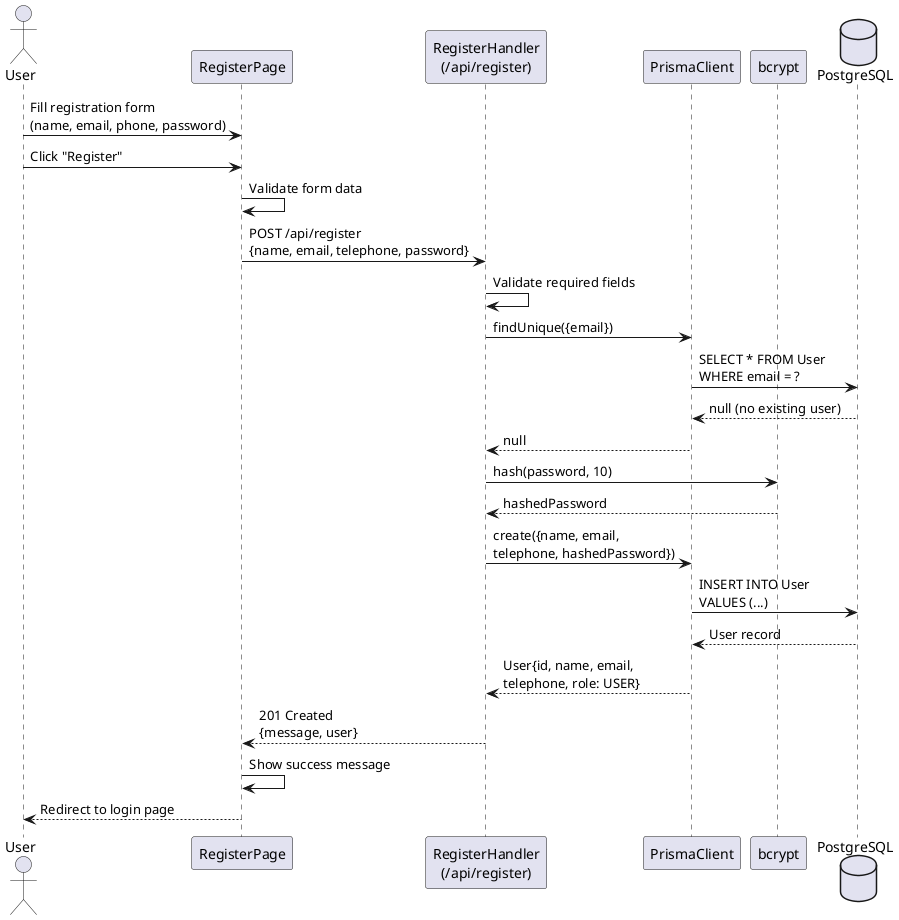

---

## 2. User Login Flow

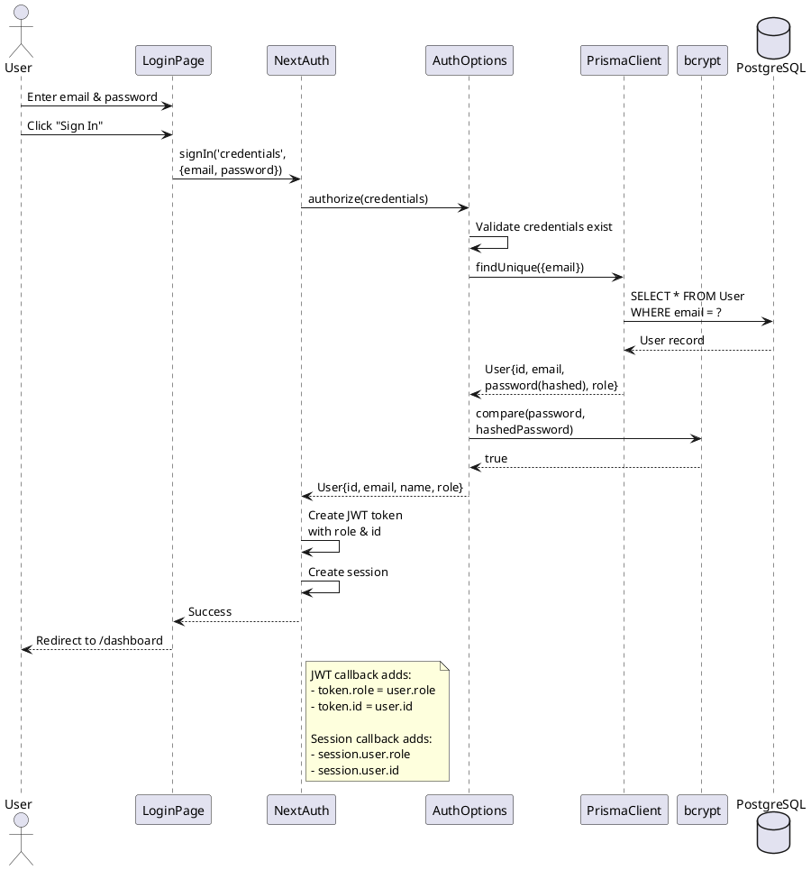

---

## 3. Make Reservation Flow (User)

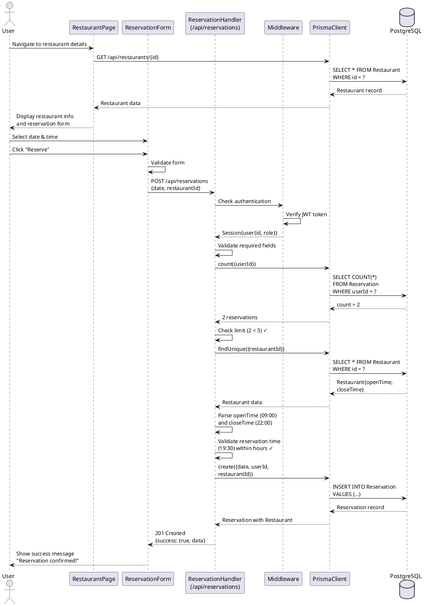

---

## 4. View User Reservations Flow

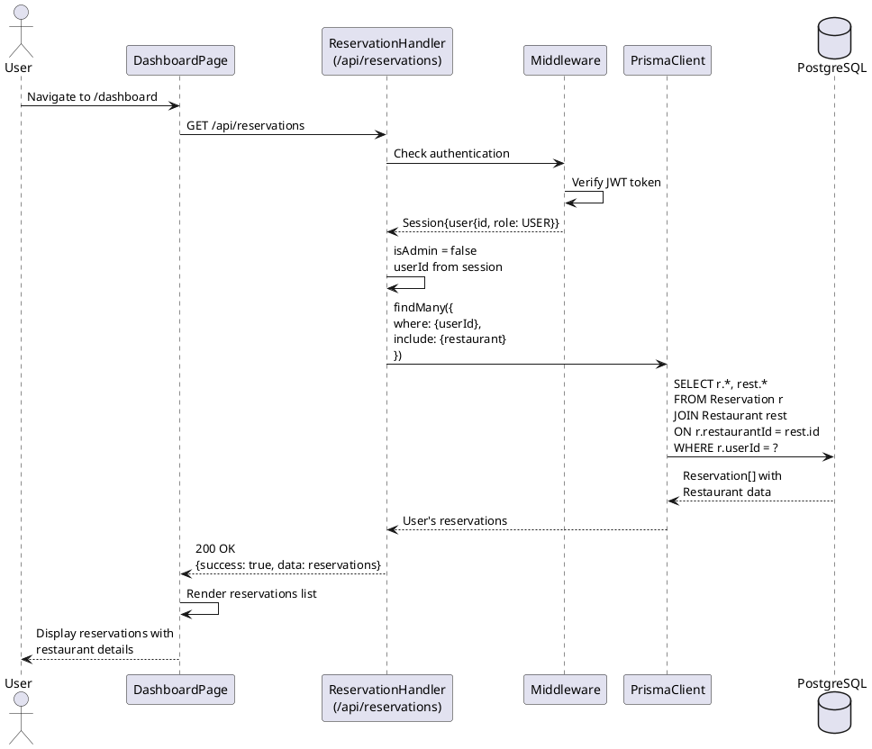

---

## 5. Cancel Reservation Flow

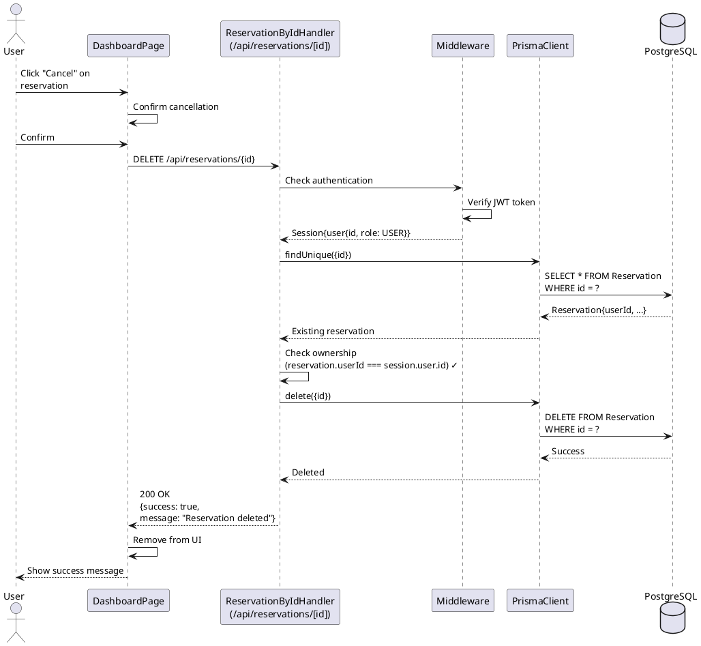

---

## 6. Admin Create Restaurant Flow

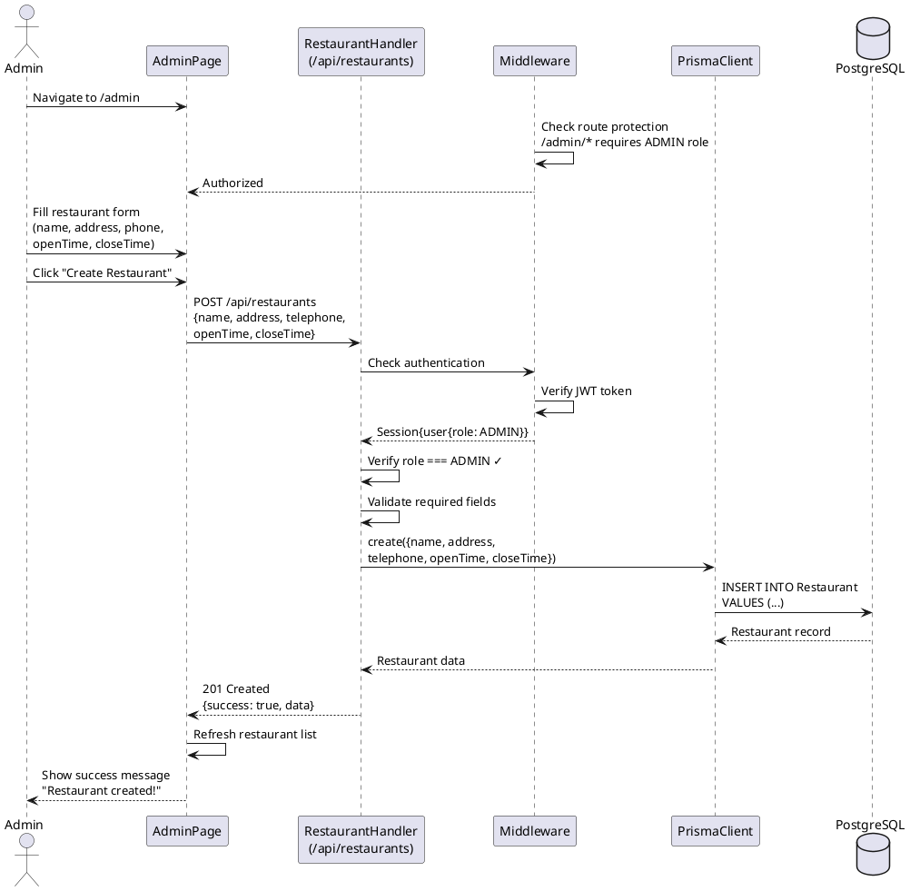

---

## 7. Admin View All Reservations Flow

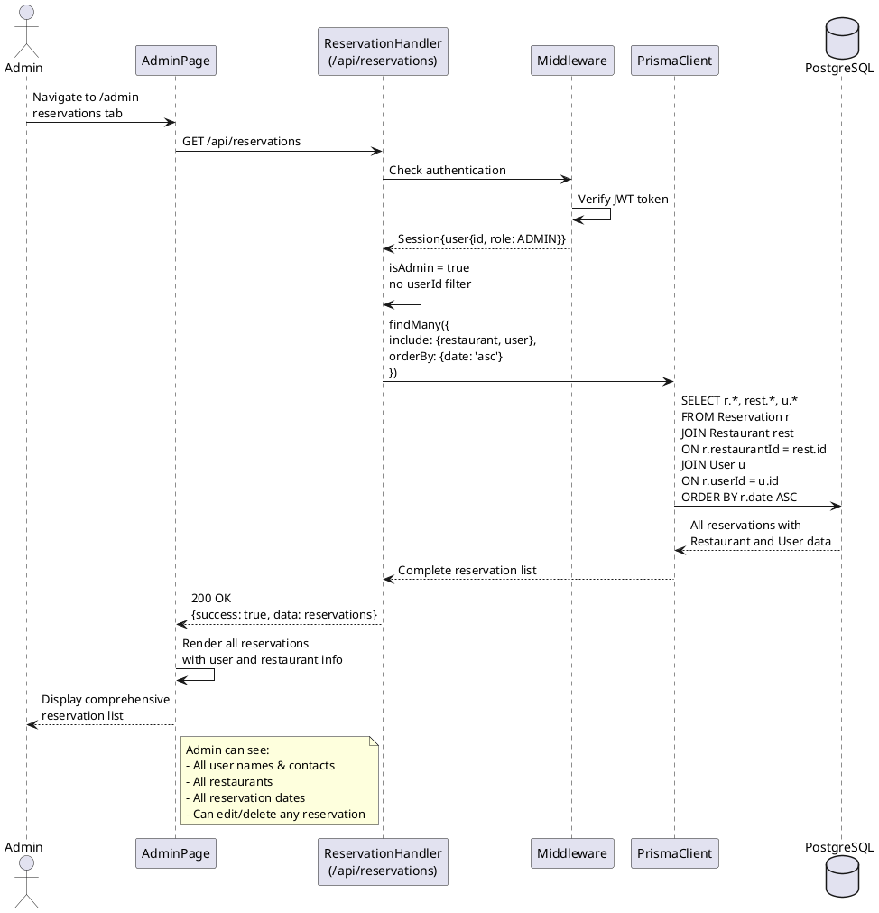

---

## 8. Update Restaurant Flow (Admin)

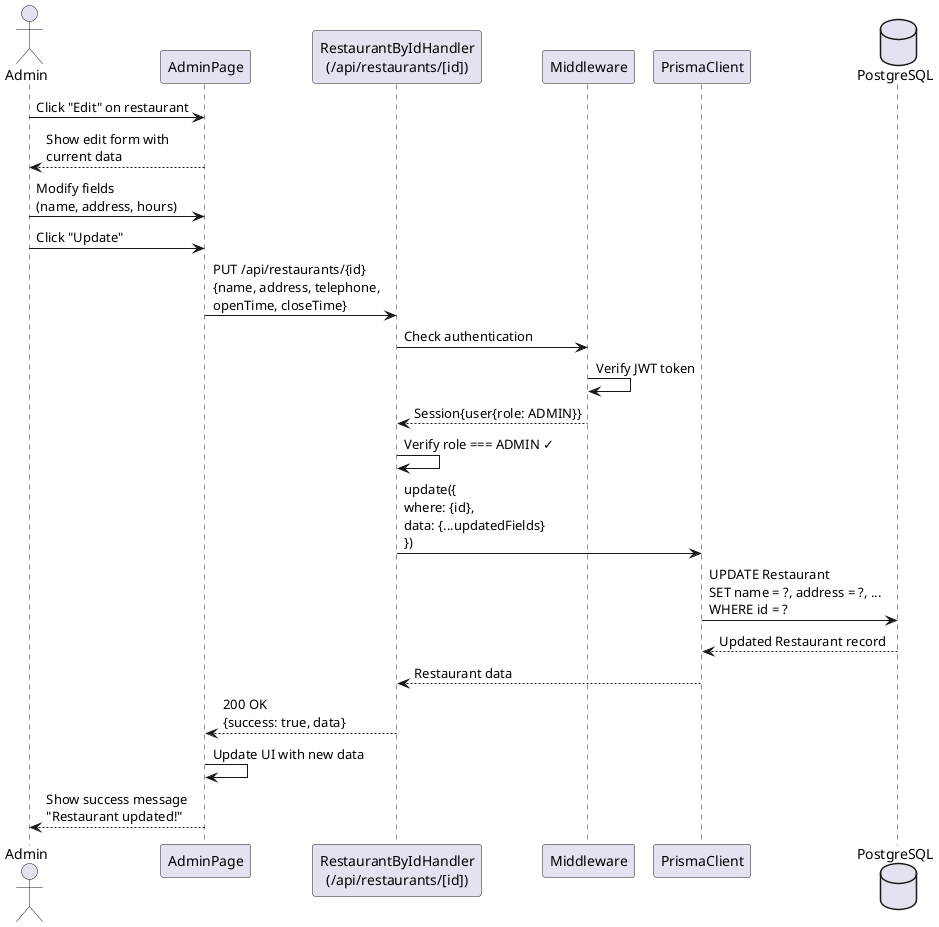

---

## 9. Delete Restaurant Flow (Admin with Cascade)

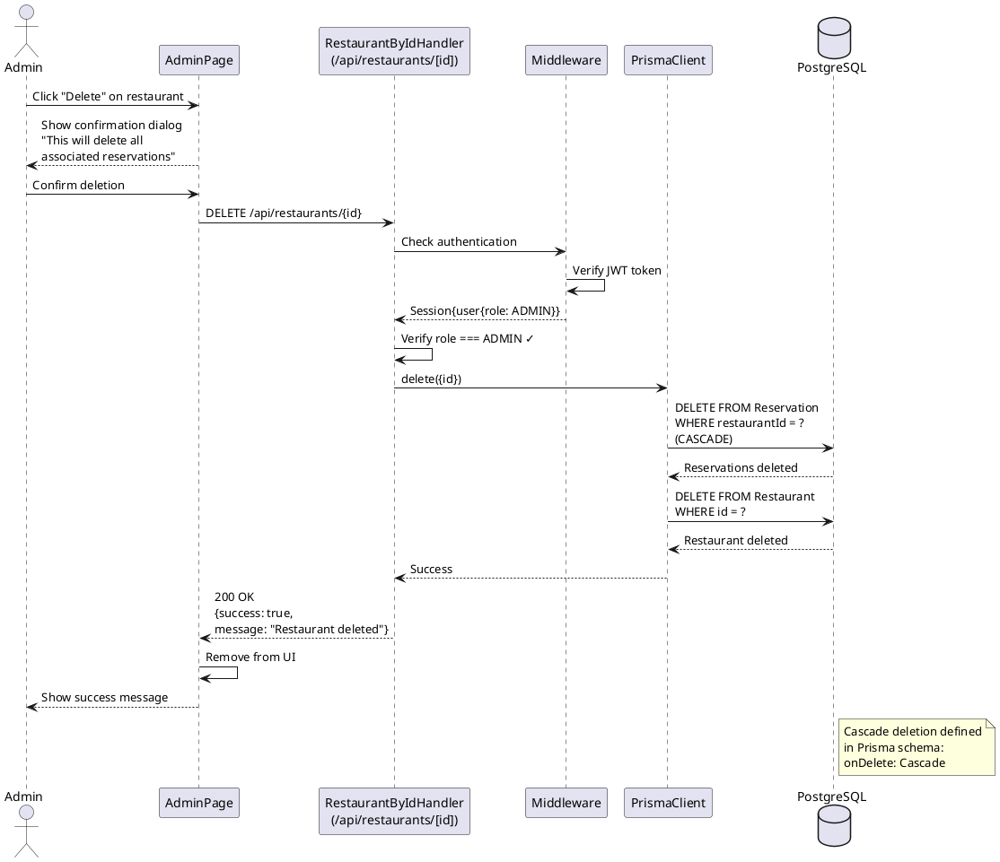

---

## 10. Middleware Authentication & Authorization Flow

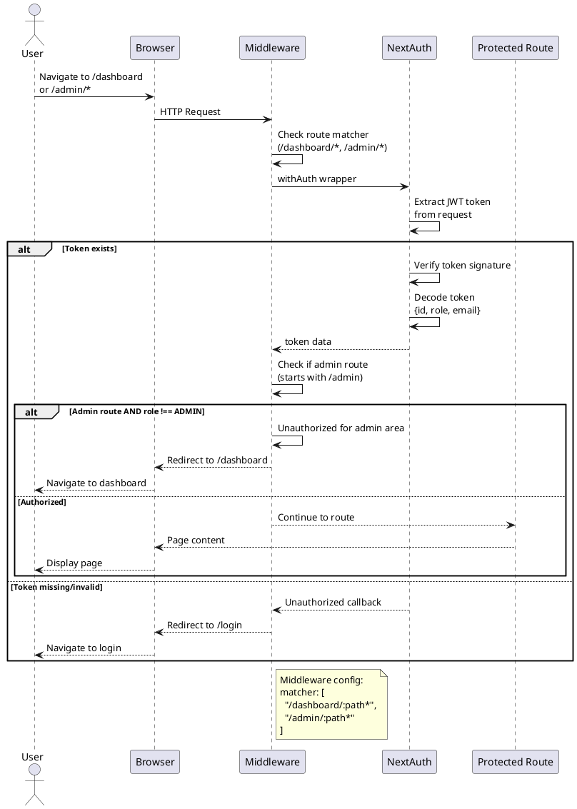

---

## 11. Error Handling - Reservation Limit Exceeded

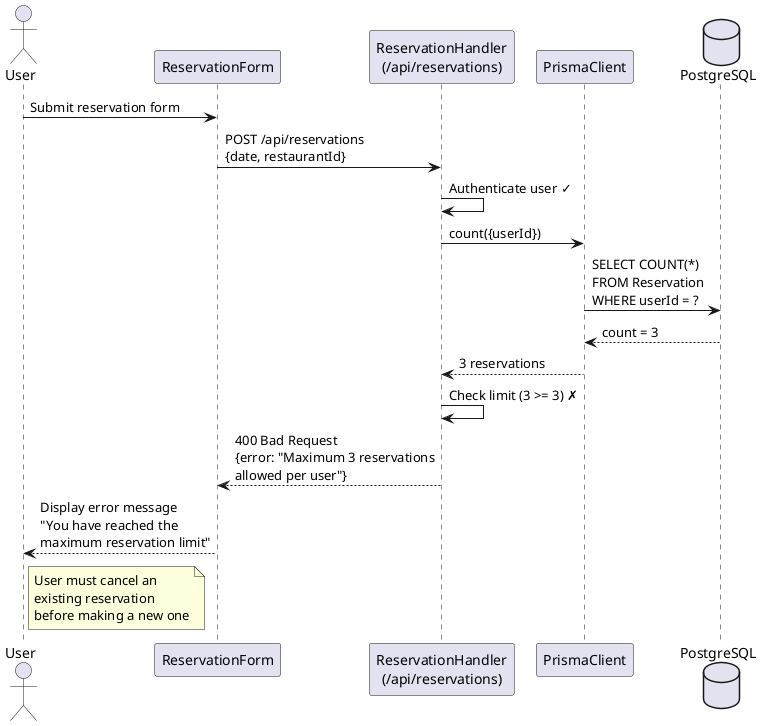

---

## 12. Error Handling - Outside Operating Hours

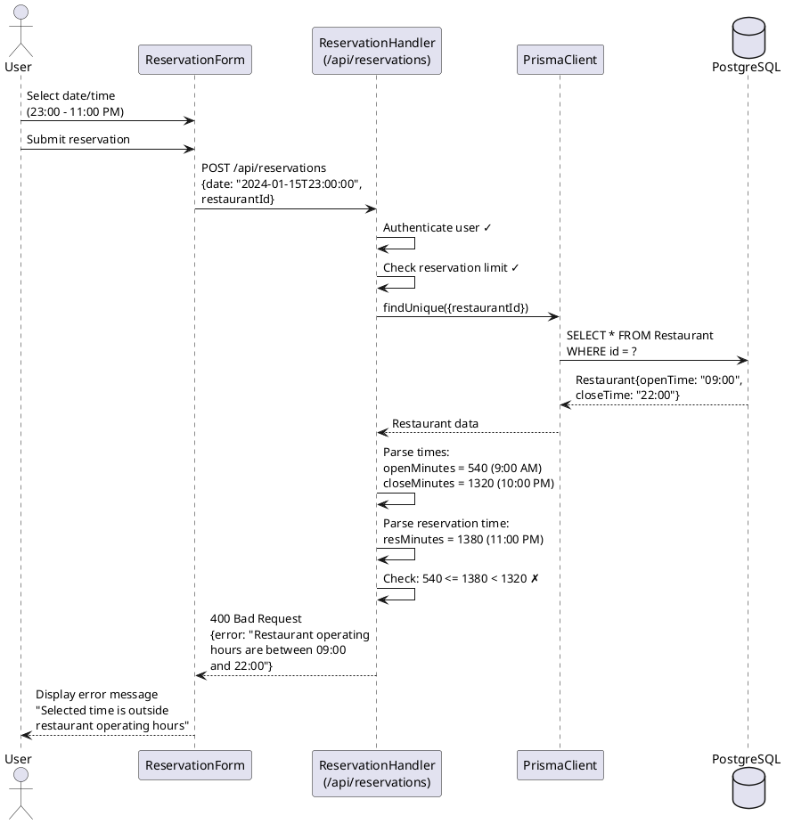

---

## Key Observations

### Authentication & Authorization Layers
1. **Middleware**: Route-level protection (checks if authenticated)
2. **API Handlers**: Operation-level authorization (checks roles and ownership)
3. **JWT Tokens**: Carry user id and role information

### Business Rules Enforcement
1. **3-Reservation Limit**: Enforced in POST /api/reservations
2. **Operating Hours**: Validated before reservation creation
3. **Ownership**: Users can only modify their own reservations
4. **Admin Privileges**: Admins bypass ownership checks and access all data

### Database Operations
1. **Cascade Deletes**: Configured in Prisma schema (onDelete: Cascade)
2. **Transactions**: Implicit in Prisma operations
3. **Indexes**: On userId and restaurantId for performance

### Error Handling
1. **400 Bad Request**: Validation errors, business rule violations
2. **401 Unauthorized**: Missing or invalid authentication
3. **403 Forbidden**: Insufficient permissions
4. **404 Not Found**: Resource doesn't exist
5. **500 Internal Server Error**: Unexpected errors

### Security Measures
1. **Password Hashing**: bcrypt with 10 rounds
2. **JWT Tokens**: Secure session management
3. **Role-Based Access Control**: USER vs ADMIN roles
4. **Input Validation**: All API endpoints validate input
5. **SQL Injection Protection**: Prisma parameterized queries