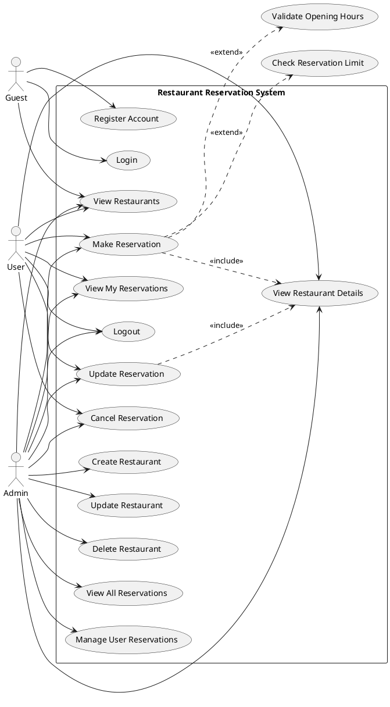

# Use Case Diagram - Restaurant Reservation System

## System Boundary: Restaurant Reservation System

### Actors:
1. **Guest** (Unauthenticated User)
2. **User** (Authenticated Regular User)
3. **Admin** (Authenticated Administrator)

---

## Use Case Diagram (PlantUML)



---

## Use Case Descriptions

### Guest Use Cases

**UC1: Register Account**
- **Actor:** Guest
- **Description:** Guest creates a new account with name, email, telephone, and password
- **Preconditions:** None
- **Postconditions:** New user account is created with USER role

**UC2: Login**
- **Actor:** Guest
- **Description:** Guest logs in with email and password credentials
- **Preconditions:** User must have a registered account
- **Postconditions:** User is authenticated and redirected to dashboard

**UC3: View Restaurants**
- **Actor:** Guest, User, Admin
- **Description:** View list of all available restaurants with their details
- **Preconditions:** None
- **Postconditions:** Restaurant list is displayed

### User Use Cases

**UC4: View Restaurant Details**
- **Actor:** User, Admin
- **Description:** View detailed information about a specific restaurant including name, address, phone, and operating hours
- **Preconditions:** User must be logged in
- **Postconditions:** Restaurant details are displayed

**UC5: Make Reservation**
- **Actor:** User, Admin
- **Description:** Create a new reservation at a restaurant for a specific date and time
- **Preconditions:** 
  - User must be logged in
  - User must have fewer than 3 active reservations
  - Selected time must be within restaurant operating hours
- **Postconditions:** New reservation is created and linked to user

**UC6: View My Reservations**
- **Actor:** User, Admin
- **Description:** View all reservations made by the logged-in user
- **Preconditions:** User must be logged in
- **Postconditions:** User's reservations are displayed

**UC7: Update Reservation**
- **Actor:** User, Admin
- **Description:** Modify the date/time or restaurant of an existing reservation
- **Preconditions:** 
  - User must be logged in
  - User must own the reservation (or be an admin)
- **Postconditions:** Reservation is updated with new information

**UC8: Cancel Reservation**
- **Actor:** User, Admin
- **Description:** Delete an existing reservation
- **Preconditions:** 
  - User must be logged in
  - User must own the reservation (or be an admin)
- **Postconditions:** Reservation is deleted from system

**UC9: Logout**
- **Actor:** User, Admin
- **Description:** End the current authenticated session
- **Preconditions:** User must be logged in
- **Postconditions:** User session is terminated

### Admin Use Cases

**UC10: Create Restaurant**
- **Actor:** Admin
- **Description:** Add a new restaurant to the system with name, address, telephone, and operating hours
- **Preconditions:** User must be logged in as Admin
- **Postconditions:** New restaurant is created in the system

**UC11: Update Restaurant**
- **Actor:** Admin
- **Description:** Modify information of an existing restaurant
- **Preconditions:** User must be logged in as Admin
- **Postconditions:** Restaurant information is updated

**UC12: Delete Restaurant**
- **Actor:** Admin
- **Description:** Remove a restaurant from the system (cascades to delete all associated reservations)
- **Preconditions:** User must be logged in as Admin
- **Postconditions:** Restaurant and all its reservations are deleted

**UC13: View All Reservations**
- **Actor:** Admin
- **Description:** View all reservations made by all users across all restaurants
- **Preconditions:** User must be logged in as Admin
- **Postconditions:** Complete list of all reservations is displayed with user information

**UC14: Manage User Reservations**
- **Actor:** Admin
- **Description:** Update or cancel any user's reservation
- **Preconditions:** User must be logged in as Admin
- **Postconditions:** Target reservation is modified or deleted

---

## Business Rules

1. **Maximum Reservation Limit:** Each user can have a maximum of 3 active reservations
2. **Operating Hours Validation:** Reservations must be made within restaurant operating hours
3. **Authentication Required:** All reservation operations require user authentication
4. **Authorization Levels:** 
   - Regular users can only manage their own reservations
   - Admins can manage all reservations and restaurants
5. **Cascade Deletion:** Deleting a restaurant also deletes all its associated reservations
6. **Cascade Deletion:** Deleting a user also deletes all their associated reservations

---

## ASCII Use Case Diagram

```
                    ┌─────────────────────────────────────────────────┐
                    │   Restaurant Reservation System                 │
                    │                                                 │
    ┌───────┐       │  ┌──────────────────┐  ┌──────────────────┐  │
    │       │       │  │ Register Account │  │      Login        │  │
    │ Guest ├───────┼─▶│                  │  │                  │  │
    │       │       │  └──────────────────┘  └──────────────────┘  │
    └───────┘       │  ┌──────────────────┐                        │
                    │  │ View Restaurants │◀────────────────┐      │
                    │  └──────────────────┘                 │      │
                    │           ▲                            │      │
                    │           │                            │      │
    ┌───────┐       │           │   ┌──────────────────┐    │      │
    │       │       │           └───│ View Restaurant  │    │      │
    │ User  ├───────┼───────────────│     Details      │    │      │
    │       │       │               └──────────────────┘    │      │
    └───────┘       │                        │              │      │
                    │               ┌────────▼────────┐     │      │
                    │               │ Make Reservation│     │      │
                    │               └─────────────────┘     │      │
                    │               ┌─────────────────┐     │      │
                    │               │ View My         │     │      │
                    │               │ Reservations    │     │      │
                    │               └─────────────────┘     │      │
                    │               ┌─────────────────┐     │      │
                    │               │ Update          │     │      │
                    │               │ Reservation     │     │      │
                    │               └─────────────────┘     │      │
                    │               ┌─────────────────┐     │      │
                    │               │ Cancel          │     │      │
                    │               │ Reservation     │     │      │
                    │               └─────────────────┘     │      │
                    │                                       │      │
    ┌───────┐       │  ┌──────────────────┐                │      │
    │       │       │  │ Create Restaurant│                │      │
    │ Admin ├───────┼─▶│                  │                │      │
    │       │       │  └──────────────────┘                │      │
    └───────┘       │  ┌──────────────────┐                │      │
         │          │  │ Update Restaurant│                │      │
         │          │  └──────────────────┘                │      │
         │          │  ┌──────────────────┐                │      │
         │          │  │ Delete Restaurant│                │      │
         │          │  └──────────────────┘                │      │
         │          │  ┌──────────────────┐                │      │
         │          │  │ View All         │                │      │
         └──────────┼─▶│ Reservations     │                │      │
                    │  └──────────────────┘                │      │
                    │  ┌──────────────────┐                │      │
                    │  │ Manage User      │                │      │
                    │  │ Reservations     │                │      │
                    │  └──────────────────┘                │      │
                    │                                       │      │
                    │  (Admin inherits all User use cases)  │      │
                    │                                       │      │
                    └───────────────────────────────────────┴──────┘
```
